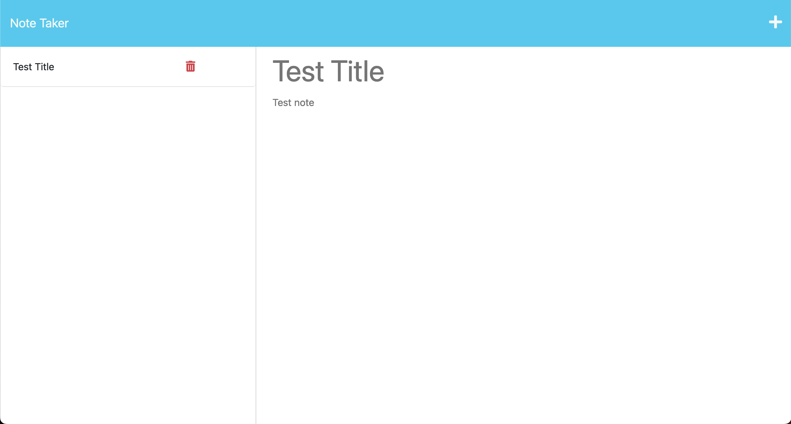

# Note taker
[](https://opensource.org/licenses/MIT)    


--- 
> The Note Taker was developed as a component of the Berkeley Coding Bootcamp Challenge 11. The application can be used to write, save, read and delete notes.
- The [Live Preview](https://note--taker.herokuapp.com)

---
## Table of Contents
* [General Information](#general-information)
* [Preview](#preview)
* [Technologies Used](#technologies-used)
* [Installation](#installation)
* [Usage](#usage)
* [Project Status](#project-status)
* [User Story](#user-story)
* [Acceptance Criteria](#acceptance-criteria)
* [Contact](#contact)
* [License](#license)

---
## General Information 
>The main purpose of the Note Taker application is to provide users with a convenient way to store and organize their notes, thereby improving their overall experience. By enabling users to save and manage their notes, the application helps them keep track of their tasks and thoughts in a structured manner The starter code for this project was downloaded from [coding-boot-camp](https://github.com/coding-boot-camp/miniature-eureka).The development of the application was done accordingly to [user story](#user-story) and [acceptance criteria](#acceptance-criteria).

---
## Preview 

 

---
## Technologies Used
*  JavaScript
*  Node.js v18.12.1
*  Express v4.18.2
*  FS v0.0.1-security
*  UUID v4
*  DOTENV v16.0.3

---
## Installation
* There is no need for installation as the web application is readily available for use [here](https://note--taker.herokuapp.com)

---
## Usage
- Upon launching the [Note Taker](https://note--taker.herokuapp.com) application, users are directed to a landing page. Once the user clicks the "Get Started" button, they are redirected to a notes page where they can begin to create and manage their notes.
- To initiate the creation of a new note, the user can click on the "+" icon located in the top right corner of the notes page. This action will open a blank note where the user can enter the relevant details, such as the note's title and body content.
- After entering the note details, the user can save it to the database by clicking on the "save" icon located in the top right corner of the notes page.
- To view the details of an existing note, the user can click on any of the notes listed in the left-hand column. Upon selecting a note, the Note Taker application retrieves the content of that note from the database and displays it to the user.
- If a user wishes to delete a specific note, they can do so by clicking on the "delete" icon located next to the note's title in the left-hand column. This action will remove the selected note from the database, and it will no longer be displayed in the notes list.

---
## Project Status 
- Project is: Complete 

---
## User Story
```md
AS A small business owner
I WANT to be able to write and save notes
SO THAT I can organize my thoughts and keep track of tasks I need to complete
```  

---
## Acceptance Criteria
```md
GIVEN a note-taking application
WHEN I open the Note Taker
THEN I am presented with a landing page with a link to a notes page
WHEN I click on the link to the notes page
THEN I am presented with a page with existing notes listed in the left-hand column, plus empty fields to enter a new note title and the note’s text in the right-hand column
WHEN I enter a new note title and the note’s text
THEN a Save icon appears in the navigation at the top of the page
WHEN I click on the Save icon
THEN the new note I have entered is saved and appears in the left-hand column with the other existing notes
WHEN I click on an existing note in the list in the left-hand column
THEN that note appears in the right-hand column
WHEN I click on the Write icon in the navigation at the top of the page
THEN I am presented with empty fields to enter a new note title and the note’s text in the right-hand column
```  

---
## Contact
-  [Olena P](https://github.com/UserOlena)

---
## License
- This project is open source and available under the [MIT](./LICENSE)
